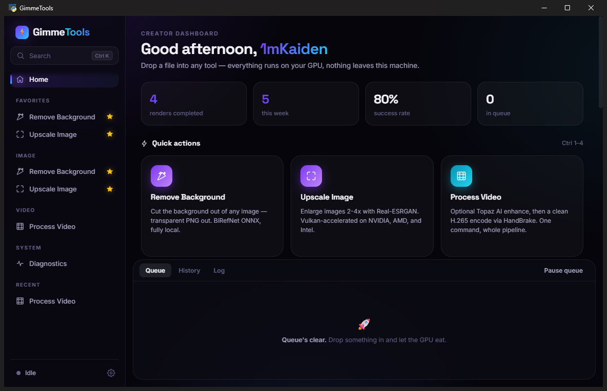
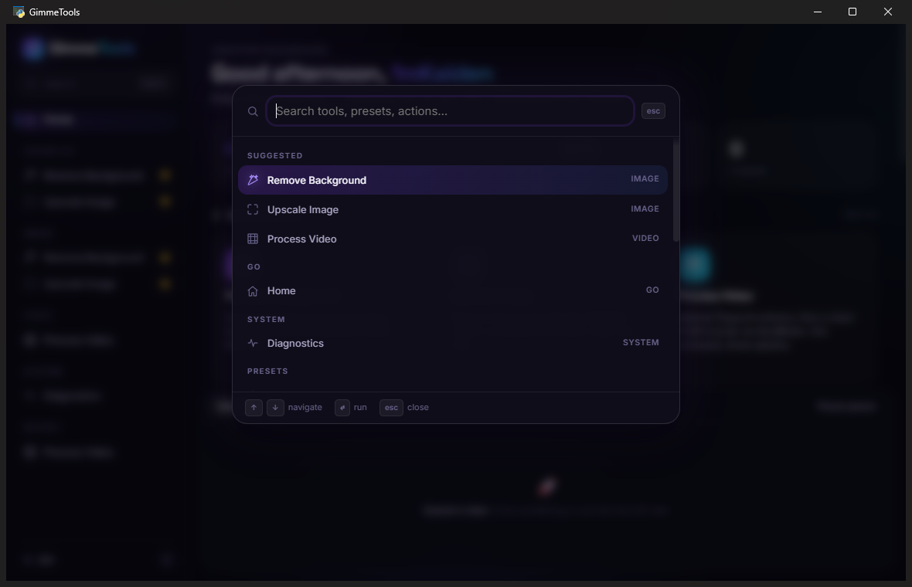
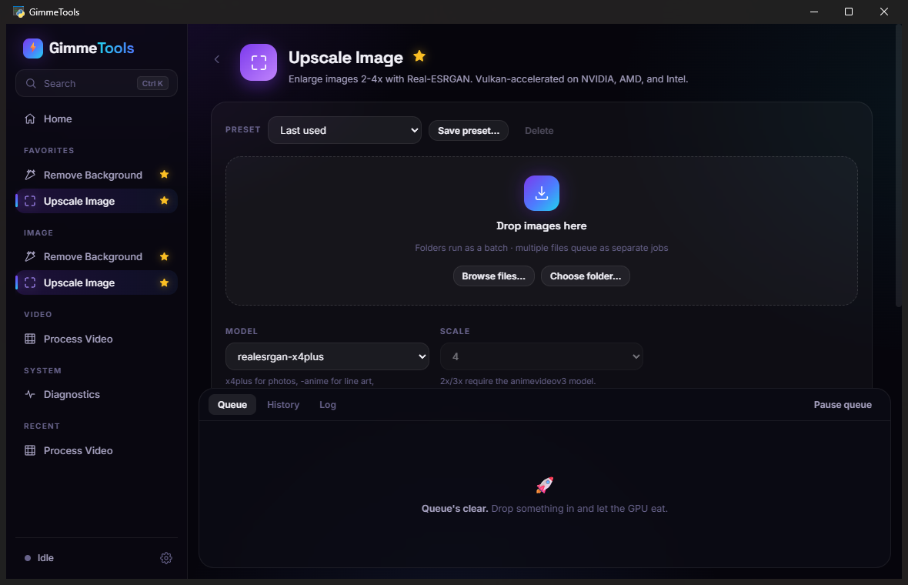
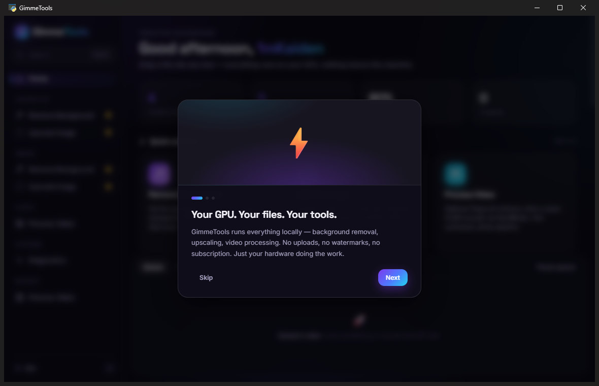

<div align="center">

# GimmeTools

### local media toolkit · no cloud · no cap

A clean cyberpunk desktop toolkit for the three things you keep needing — **remove backgrounds**, **upscale images**, **process video**. GPU-accelerated, runs entirely on your machine.




<table>
  <tr>
    <td></td>
    <td></td>
    <td></td>
  </tr>
</table>

</div>

---

## ⬇️ Install

**From a release** (when available): grab the installer or portable zip from
[Releases](https://github.com/imKaidenn/GimmeTools/releases) and run `GimmeTools.exe`.

**From source:**
```
1. Download or clone this repo
2. Double-click  GimmeTools.bat
3. Done.
```

First launch offers a one-click setup that builds a local Python venv inside `tools/venv/` and installs the right ONNX Runtime for your GPU (NVIDIA / AMD / Intel / CPU — auto-detected). Takes a few minutes once, instant after that.

Sister project to [**GimmeDat**](https://github.com/imKaidenn/GimmeDat) — same cyberpunk family.

---

## ✨ Features

- 🪄 **Remove backgrounds** — `rembg` + **BiRefNet** ONNX. Transparent PNGs out, batch a whole folder if you want.
- 🔍 **Upscale images** — **Real-ESRGAN** (ncnn-vulkan). Works on NVIDIA / AMD / Intel GPUs via Vulkan. 2× / 4×, photo or anime models.
- 🎬 **Process video** — **HandBrakeCLI** encode, optional **Topaz Video AI** enhance pass if you own it. H.265 1080p preset bundled.
- 🚀 **GPU auto-detect** — reads display adapters from the registry, installs `onnxruntime-gpu` / `directml` / `cpu` as appropriate. No driver gymnastics.
- 🖥 **Desktop app (v2)** — command palette (Ctrl+K), sidebar with favorites & recents, drag-and-drop, batch queue with pause/reorder, job history, saved presets, toasts, keyboard shortcuts. Native window + system WebView2, ~1s startup. Classic UI kept as fallback.
- ⌨ **CLI too** — every tool is a standalone Python script under `scripts/` — use the UI or the terminal.
- 🪟 **Right-click menu (optional)** — `install\register_context_menu.ps1` adds GimmeTools actions to the Windows right-click menu for images and videos.
- 💜 **All local.** No uploads, no API keys, no cloud bills.

---

## 🛠 What you need

| Thing | Why | How |
|---|---|---|
| **Python 3.10+** | Backend venv | One-time install from [python.org](https://www.python.org/downloads/), tick **Add Python to PATH** |
| **ffmpeg** *(for video)* | Probe + remux | Drop `ffmpeg.exe` into `tools\ffmpeg\` or have it on PATH |
| **HandBrakeCLI** *(for video)* | Encoder | Get from [handbrake.fr/downloads2.php](https://handbrake.fr/downloads2.php) — put `HandBrakeCLI.exe` on PATH or in `tools\handbrake\` |
| **realesrgan-ncnn-vulkan** *(for upscale)* | Vulkan upscaler | Unzip into `tools\realesrgan\` from [github.com/xinntao/Real-ESRGAN/releases](https://github.com/xinntao/Real-ESRGAN/releases) |
| **Topaz Video AI** *(optional)* | Pro video enhance | Used if installed — toolkit auto-discovers it |

Models for `rembg` download on first use into `models/`.

---

## 🧪 Command-line usage

The backend's packages live in the local venv, so use its interpreter
(`tools\venv\Scripts\python.exe`, created by first launch / setup):

```bat
set PY=tools\venv\Scripts\python.exe

:: remove a background → transparent PNG
%PY% scripts\remove_bg.py photo.jpg

:: batch a folder
%PY% scripts\remove_bg.py photos\ --batch

:: upscale to 4× with the anime model
%PY% scripts\upscale_image.py photo.jpg --scale 4 --model realesrgan-x4plus-anime

:: 2×/3× upscales need the multi-scale model
%PY% scripts\upscale_image.py photo.jpg --scale 2 --model realesr-animevideov3

:: encode a video (HandBrake H.265 1080p preset)
%PY% scripts\process_video.py input.mp4

:: skip the Topaz pass even if it's installed
%PY% scripts\process_video.py input.mp4 --skip-topaz

:: check what GimmeTools detected on this machine
%PY% scripts\diagnose.py
```

---

## 📂 Layout

```
GimmeTools/
  GimmeTools.bat         ← double-click launcher
  app/                   ← v2 desktop app (pywebview shell, services, web UI)
  ui/gimmetools.py       ← classic customtkinter UI (fallback)
  scripts/
    remove_bg.py         ← rembg + BiRefNet
    upscale_image.py     ← Real-ESRGAN
    process_video.py     ← HandBrakeCLI + optional Topaz
    diagnose.py          ← what's installed, what isn't
    lib/                 ← config, GPU detect, logger, tool discovery
  install/
    setup.py             ← pure-python installer (no PowerShell needed)
    requirements.txt
    register_context_menu.ps1
  config/                ← HandBrake H.265 preset
  models/                ← rembg models (downloaded on first use)
  tools/                 ← ffmpeg / HandBrake / Real-ESRGAN binaries
  outputs/               ← processed files land here by default
  docs/                  ← audit report & release notes
```

---

## 📜 License

GPL-3.0 — see [`LICENSE`](LICENSE). Copyright © 2026 Kaiden.

This project bundles **no** third-party binaries. ffmpeg, HandBrakeCLI, Real-ESRGAN, and Topaz Video AI are downloaded by you from their respective vendors under their own licenses. GimmeTools wraps and orchestrates them locally.

---

<div align="center">

**made by Kaiden**

[☕ Buy me a coffee](https://buymeacoffee.com/ridhakaiden) · [PayPal](https://paypal.me/1mkaiden)

</div>
